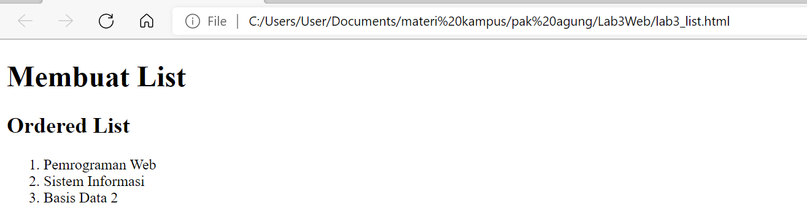
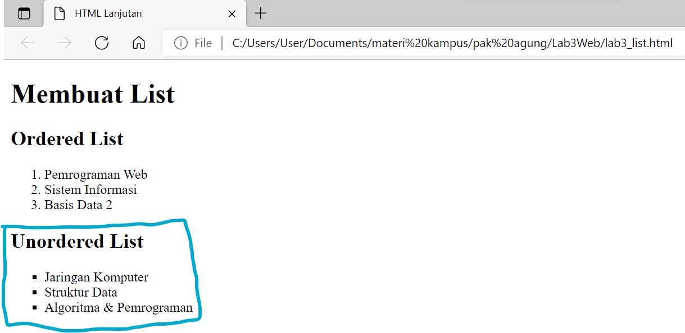
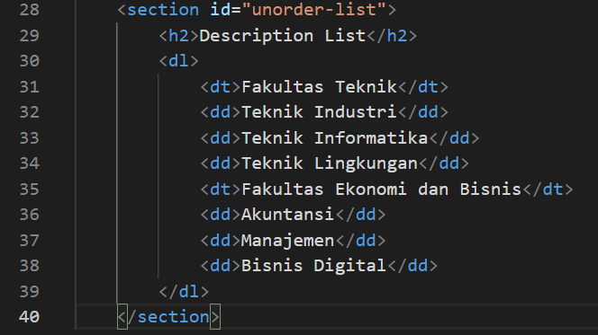
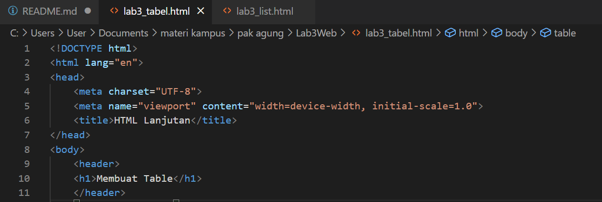
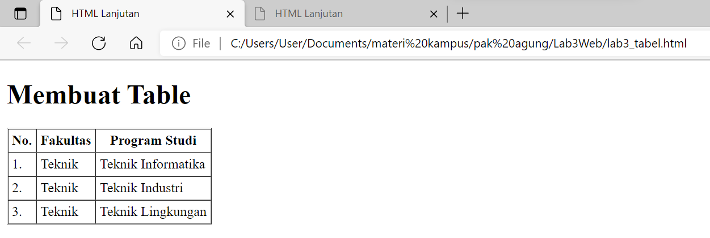

# Praktikum 3: Membuat List, Table dan Form

<strong>Repository ini dibuat untuk memenuhi tugas Pemrograman Web</strong>
| <strong>Nama</strong>      | <strong>Riris Naomi Gurning</strong>  |
| ----------- | ----------- |
| <strong>NIM</strong>     | <strong>312010190</strong>       |
| <strong>Kelas</strong>   | <strong>TI.20.A.1</strong>        |

# Langkah-langkah Praktikum 3

1. Pertama - tama membuka VSCode
 

2. Kemudian membuat dokumen HTML dengan nama <b><i>file lab3_list.html</i></b>
   
2.1 Kerangka di VSCode

 
   
2.2 Ini hasil di Microsoft Edge

3. Kemudian tambahkan kode untuk membuat <b><i>Ordered List</i></b> seperti berikut.
 
    
3.1 Ini hasil di Microsoft Edge

 
<strong>Jadi ordered list untuk menampilkan urutan dengan angka</strong>

4. Kemudian tambakan kode untuk membuat <b><i>Unordered List</i></b>, setelah deklarasi ordered list pada section unordered-list, seperti berikut.
 
   
4.1 Ini hasil di Microsoft Edge

<strong>Jadi <b><i>Unordered List</i></b> untuk menampilkan urutan dengan titik</strong>

5. Kemudian tambahkan kode untuk membuat <b><i>description list</i></b> setelah deklarasi unorderd-list.
 
   
5.1 Ini hasil di Microsoft Edge

 
 <strong>
Jadi <b><i>description list</i></b> untuk menampilkan huruf lebih kedalam </strong>

6. Setelah itu buat file baru dengan nama lab3_tabel.html seperti berikut.
   
6.1 Kerangka di VSCode

 
 

<strong>
Jadi file ini menampilkan sebuah tabel</strong>

 
7. Untuk mengatur margin dan padding pada cel data, tambahkan atribut cellpadding dan cellspacing pada tag table.
   
7.1 Kerangka di VSCode

 
   
7.2 Ini hasil di Microsoft Edge

<strong>
Jadi untuk mengatur margin dan padding pada cel data harus menggunakan atribut tambahan tersebut</strong>

8. Langkah selanjutnya menggabungkan sel data. 
   
 Untuk menggabungkan sel data, gunakan atribut rowspan dan colspan. Atribut rowspan untuk
menggabungkan baris (secara vertikal) dan colspan untuk menggabungkan kolom (secara
horizontal).

 