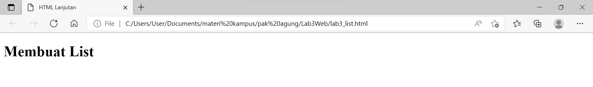

# Praktikum 3: Membuat List, Table dan Form

<strong>Repository ini dibuat untuk memenuhi tugas Pemrograman Web</strong>
| <strong>Nama</strong>      | <strong>Riris Naomi Gurning</strong>  |
| ----------- | ----------- |
| <strong>NIM</strong>     | <strong>312010190</strong>       |
| <strong>Kelas</strong>   | <strong>TI.20.A.1</strong>        |

# Langkah-langkah Praktikum 3

1. Pertama - tama membuka VSCode
  
2. Kemudian membuat dokumen HTML dengan nama file lab3_list.html
    i. Kerangka di VSCode
     
    ii. Ini hasil di Microsoft Edge
     