# Praktikum 3: Membuat List, Table dan Form

<strong>Repository ini dibuat untuk memenuhi tugas Pemrograman Web</strong>
| <strong>Nama</strong>      | <strong>Riris Naomi Gurning</strong>  |
| ----------- | ----------- |
| <strong>NIM</strong>     | <strong>312010190</strong>       |
| <strong>Kelas</strong>   | <strong>TI.20.A.1</strong>        |

# Langkah-langkah Praktikum 3

1. Pertama - tama membuka VSCode
 

2. Kemudian membuat dokumen HTML dengan nama <b><i>file lab3_list.html</i></b>
   
Kerangka di VSCode

 
 
   
Ini hasil di Microsoft Edge

3. Kemudian tambahkan kode untuk membuat <b><i>Ordered List</i></b> seperti berikut.
 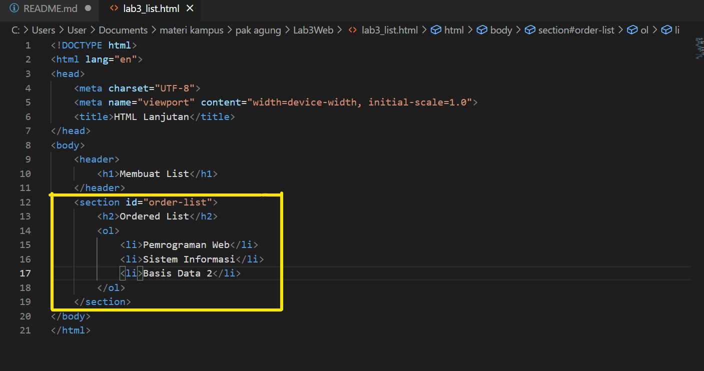
 
    
Ini hasil di Microsoft Edge

<strong>Jadi ordered list untuk menampilkan urutan dengan angka</strong>

4. Kemudian tambakan kode untuk membuat <b><i>Unordered List</i></b>, setelah deklarasi ordered list pada section unordered-list, seperti berikut.
 
 
   
Ini hasil di Microsoft Edge

<strong>Jadi <b><i>Unordered List</i></b> untuk menampilkan urutan dengan titik</strong>

5. Kemudian tambahkan kode untuk membuat <b><i>description list</i></b> setelah deklarasi unorderd-list.
   
Kerangka di VSCode

 
 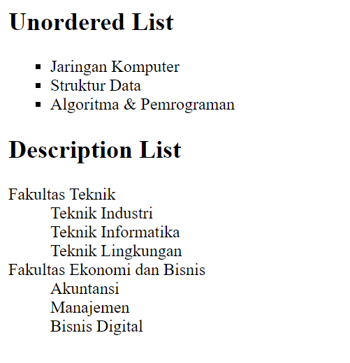
   
Ini hasil di Microsoft Edge

 <strong>
Jadi <b><i>description list</i></b> untuk menampilkan huruf lebih kedalam </strong>

6. Setelah itu buat file baru dengan nama lab3_tabel.html seperti berikut.
   
Kerangka di VSCode

  
  
 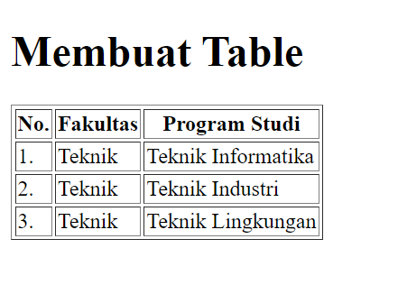
   
Ini hasil di Microsoft Edge

<strong>
Jadi file ini menampilkan sebuah tabel</strong>

7. Untuk mengatur margin dan padding pada cel data, tambahkan atribut cellpadding dan cellspacing pada tag table.
   
Kerangka di VSCode

 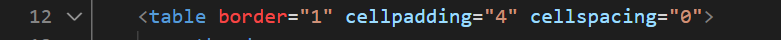
 
   
Ini hasil di Microsoft Edge

 <strong>
Jadi untuk mengatur margin dan padding pada cel data harus menggunakan atribut tambahan tersebut</strong>

8. Langkah selanjutnya menggabungkan sel data. 
   
 Untuk menggabungkan sel data, gunakan atribut rowspan dan colspan. Atribut rowspan untuk menggabungkan baris (secara vertikal) dan colspan untuk menggabungkan kolom (secara horizontal).

 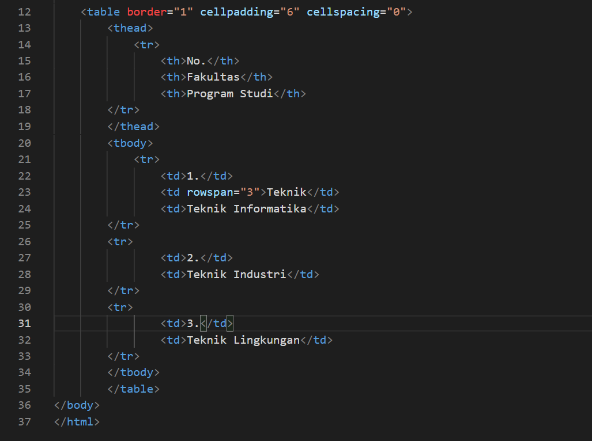
 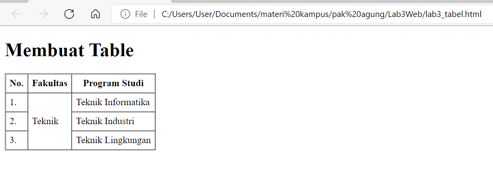
   
Ini hasil di Microsoft Edge

9. Kemudia membuat file baru dengan nama lab3_form.html seperti berikut.
   
Kerangka di VSCode

 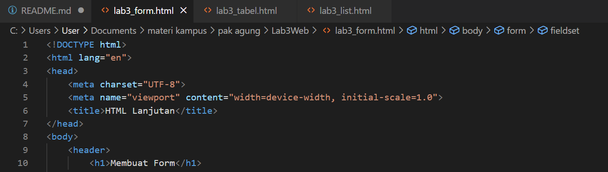
 
 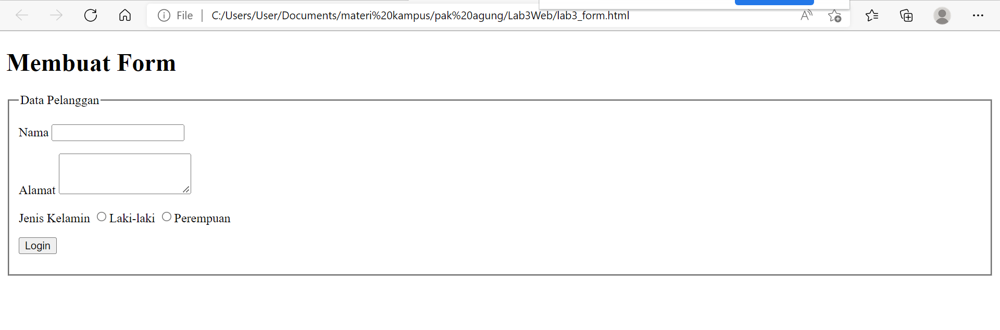
   
Ini hasil di Microsoft Edge

10. Supaya tampilan formnya lebih menarik, perlu ditambahkan CSS sebagai berikut:
   
 Kerangka di VSCode

 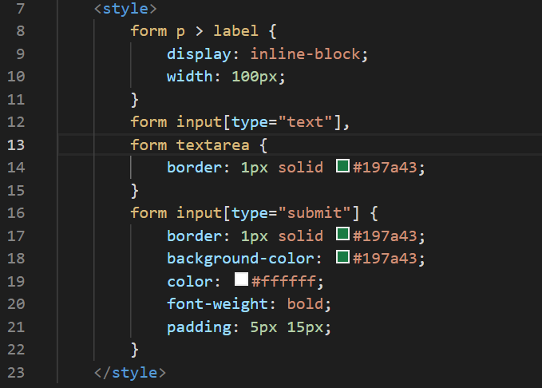
 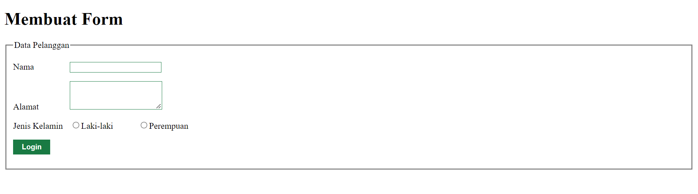
    
Ini hasil di Microsoft Edge

# Pertanyaan dan Tugas
1. 
Buatlah form yang menampilkan dropdown menu dan listbox dengan multiple selection.

# Jawaban
saya akan membuat dropdownmenu dan listbox dengan multiple selection menggunakan VSCode
1. Pertama tama saya membuat file dengan nama <b>lab3_form-dropdown.html</b>
2. Setelah itu saya membuat kerangka htmlnya
  
saya membuat kerangka pertamanya style, kemudian h1, selanjutnya < form action="proses.php" method="post">. Gambarannya seperti berikut:
 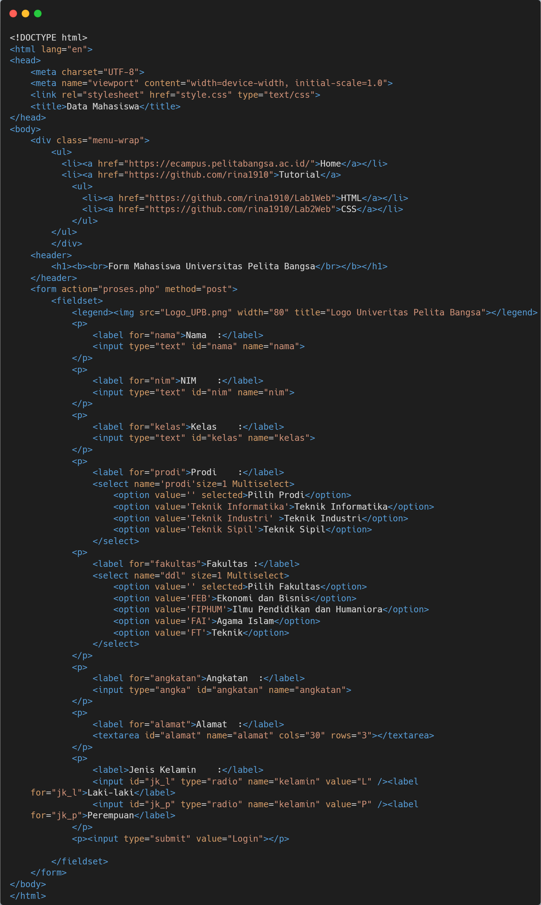
3. Dan inilah hasilnya
 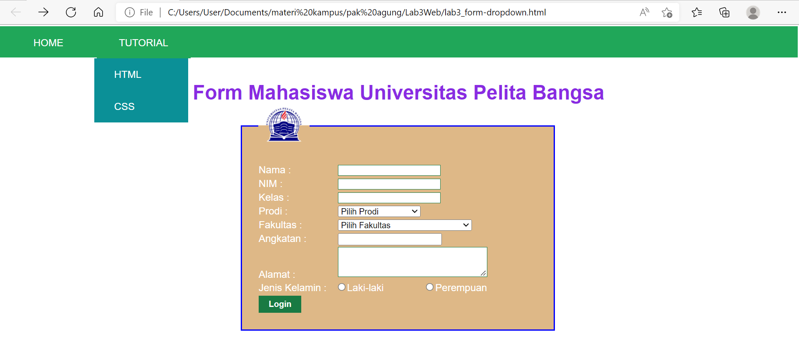

 